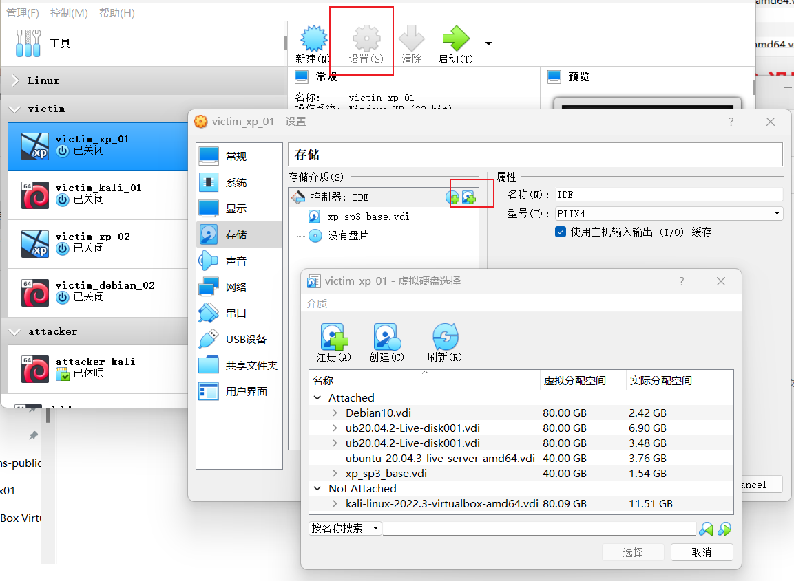

# 第一章 基于 VirtualBox 的网络攻防基础环境搭建


## 实验目的

- 掌握 VirtualBox 虚拟机的安装与使用；
- 掌握 VirtualBox 的虚拟网络类型和按需配置；
- 掌握 VirtualBox 的虚拟硬盘多重加载；


## 实验环境

- Windows 11 宿主机
- VirtualBox 虚拟机
- 攻击者主机（Attacker）：Kali Rolling 2019.2
- 网关（Gateway, GW）：Debian Buster
- 靶机（Victim）：From Sqli to shell / xp-sp3 / Kali


## 实验要求

- 虚拟硬盘配置成多重加载；

- 搭建满足如下拓扑图所示的虚拟机网络拓扑；


- 完成以下网络连通性测试；
  - [x] 靶机可以直接访问攻击者主机
  - [x] 攻击者主机无法直接访问靶机
  - [x] 网关可以直接访问攻击者主机和靶机
  - [x] 靶机的所有对外上下行流量必须经过网关
  - [x] 所有节点均可以访问互联网


## 实验步骤

配置完成后各主机 IP 地址

| 虚拟机（攻击者/被攻击者-系统-内网） |                    连接方式                    |                             IP                             |
| :---------------------------------: | :--------------------------------------------: | :--------------------------------------------------------: |
|            attacker_kali            |                    NAT 网络                    |                         10.0.2.15                          |
|              gw_debian              | NAT 网络、Host-Ohly 网络、内部网络1、内部网络2 | 10.0.2.4 \| 192.168.56.113 \| 172.16.111.1 \| 172.16.222.1 |
|            victim_xp_01             |                   内部网络1                    |                       172.16.111.146                       |
|           victim_kali_01            |                   内部网络1                    |                       172.16.111.115                       |
|            victim_xp_02             |                   内部网络2                    |                       172.16.222.124                       |
|          victim_debian_02           |                   内部网络2                    |                       172.16.222.114                       |


### 一、配置虚拟硬盘多重加载

- `Virtualbox 虚拟机管理`->`虚拟介质管理`
- 选中需要改变类型的虚拟硬盘，先将其`释放`，然后将其`属性`->`类型`选为多重加载


需要添加多重加载的虚拟硬盘时，选中虚拟机设置，添加虚拟硬盘即可




### 二、配置 Debian（Gateway）

#### VirtualBox 的虚拟网络配置


#### Debian root SSH 登录

```bash
# To enable SSH login for a root user on Debian Linux system you need to first configure SSH server. Open /etc/ssh/sshd_config
vim /etc/ssh/sshd_config

# change the following line
# FROM:
PermitRootLogin without-password
# TO:
PermitRootLogin yes

# Once you made the above change restart your SSH server
/etc/init.d/ssh restart
```


#### 检查配置文件（老师已经配完了）

```bash
# 网卡接口文件
vim /etc/network/interfaces

# 检查DNCP文件,检查是否已开机自启动
vim 
vim /etc/dnsmaq.conf
ps aux | grep dnsm

# 验证防火墙规则是否生效
/sbin/iptables -L -t nat -n
```


#### 查看 DNS 请求日志

```bash
# 查看 DNS 请求日志
tail -F /var/log/dnsmasq.log
```


### 三、配置 Windows XP（Victim）

#### VirtualBox 的虚拟网络配置

- 启用网卡1，连接方式为内部网络，局域网一对应 intnet1
- 由于 xp 系统不支持千兆网卡，故选择百兆网卡


#### 关闭防火墙

由于防火墙对网络起到访问控制的作用，在此关闭防火墙，可以保证网关能够访问本机


#### 配置网络信息

查看本地网络链接详细信息，可以看到通过 DHCP 服务器本机已经自动获得 IP 地址、子网掩码、网关等地址信息


#### 检查网络连通性

- 网关和靶机可以互相访问，网络连通
- 靶机可以正常访问互联网，且 DNS 服务正常


### 四、配置 Kali（Victim）

#### VirtualBox 的虚拟网络配置

启用网卡1，连接方式为内部网络，intnet1


#### 检查网络分配情况和网络连通性

- 网关和靶机可以互相访问，网络连通
- 靶机可以正常访问互联网，且 DNS 服务正常


### 五、配置 Kali（Attacker）

#### VirtualBox 的虚拟网络配置


#### 网络连通性测试

- 靶机可以直接访问攻击者主机

- 攻击者主机无法直接访问靶机、网关

  

- 网关可以直接访问攻击者主机和靶机

  

- 攻击者主机可以访问互联网

  


### 六、网关网络流量监测

#### 抓包实验

```bash
# 新建一个工作目录，用于存放抓包文件
mkdir workplace
cd workplace

# 利用工具 tcpdump 抓包，并保存
tcpdump -i enp0s9 -n -w 20220912.1.pcap
```

在靶机 victim_xp_01 和 victim_kali_01 上进行网络操作，产生网络流量后退出抓包即可


#### 用 Wireshark 分析抓包

```bash
# 将抓到的包复制在宿主机中方便分析

# 在 Windows Terminal 中打开
scp root@192.168.56.113:/root/workspace20220912.1.pcap ./
```

抓包数据如下


说明靶机的所有对外上下行流量必须经过网关


## 遇到的问题及解决方法

- Windows XP（Victim） 靶机可以单向连通网关，而网关尝试 ping 时无法成功：

  ping 是通过发送 ICMP echo request 实现网络连通性检测，而 Windows 防火墙会拦截过滤外部的 request，因此需要关闭 Windows XP（Victim）的防火墙。

- 配置多重加载时发现无法改变类型

  查阅资料后得知，需要配置一台带有硬盘的虚拟机，随后将其释放，以此硬盘为基础才可进行多重加载。


## 参考资料

- [VirtualBox Network Settings: Complete Guide](https://www.nakivo.com/blog/virtualbox-network-setting-guide/#:~:text=Network%20Modes%20section.-,NAT%20Network,external%20networks%20including%20the%20internet.)
- [Virtualbox 中 Nat 和 Nat Network 模式区别](https://www.zhihu.com/question/277077127)
- [网络安全电子书 黄玮](https://c4pr1c3.github.io/cuc-ns/)
