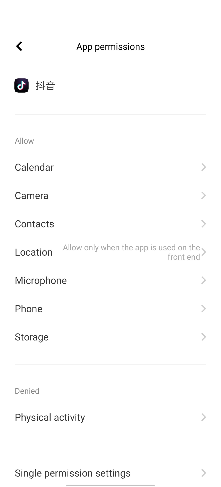
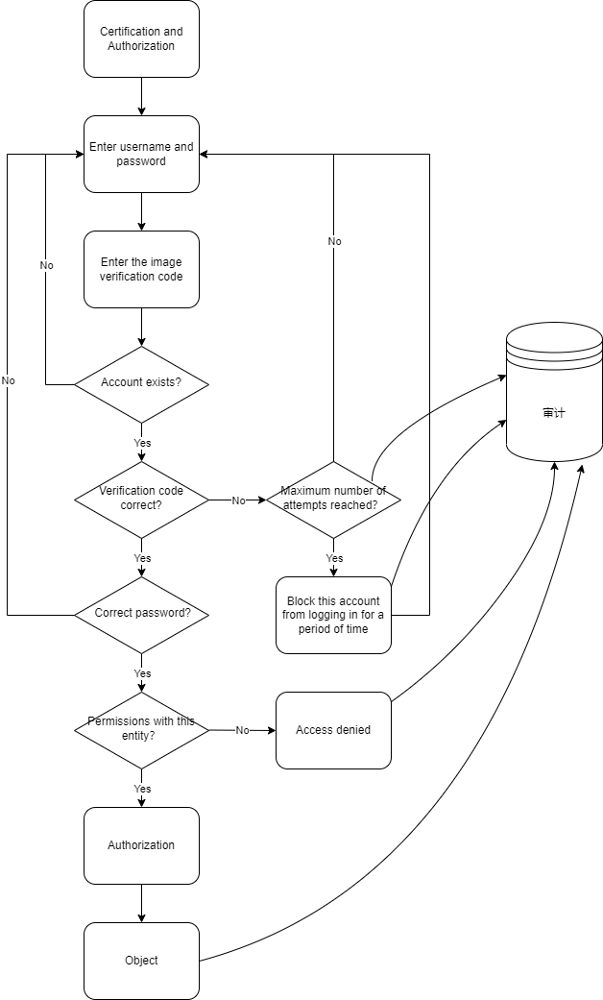

# 第二章 系统安全、风险评估理论与应用（实验）

## 实验目的

- 通过 iOS 或Android 系统为研究对象，进行访问控制的理解和设计

## 实验环境

- 操作系统版本：Android 10 originos ocean
- 硬件设备型号：vivo X50 Pro+
- 是否默认设置：是

## 操作系统的访问控制设计实例研究

- 以 iOS 和 Android 系统为研究对象
  - 当系统处于锁屏状态下接收到新短信时，不解锁情况下
    - 系统是否允许查看短信内容？
    
      不允许
    
    - 系统是否允许回复短信？
    
      不允许
    
    - 安卓上的 App : 以 ***抖音\*** 为例，在接管了系统联系人（Contacts）功能和权限之后，是否会有一些不同的功能设定？
    
      
      
      抖音再拥有访问联系人的权限后，会根据联系人来为你推荐可能认识的人。
    
  - 当系统处于锁屏状态下，使用系统内置（例如 iOS 的 Siri ）或第三方的语音助手可以完成以下哪些操作？
    - 访问通讯录
    
      不能
    
    - 拨打电话
    
      能
    
    - 访问相册
    
      不能
    
    - 查看短信收件箱
    
      不能
    
  - 如果你的手机支持指纹识别解锁手机，请实验并分析指纹识别相比较于简单密码、复杂密码、图形解锁、人脸识别解锁、声纹解锁等解锁方式的安全性、便利性差异。
  
    | 密码类型     | 安全性                                                       | 便利性                                           |
    | ------------ | ------------------------------------------------------------ | ------------------------------------------------ |
    | 简单密码     | 非常不安全，对于六位数以下的简单密码可以很轻松的暴力破解；对于偷窥密码的人也方便记忆 | 解锁较方便，记忆负担较轻                         |
    | 复杂密码     | 除苹果3D面部识别以外最安全的解锁手机方式                     | 输入非常不方便，对于记忆复杂密码也很麻烦         |
    | 图形密码     | 其强度取决于图案的复杂程度，研究发现，偷窥者偷看一次解锁图案后成功复制的几率高达64.2％，与弱口令的问题类似，图案模式越简单，越容易被他人偷窥或“暴力破解” | 比较方便，适用于对图像敏感的用户使用             |
    | 人脸识别解锁 | 人脸识别主要是特征识别，人脸识别/面部识别可能是最不安全的技术之一，可以轻松破解 | 非常方便，在光线良好的情况下正常拿起手机即可解锁 |
    | 声纹解锁     | 声纹容易被伪造从而导致安全性较低                             | 需要用户发声，影响周围人                         |
    | 指纹识别解锁 | 指纹属于人类独一无二的生物特征，不容易伪造，安全性较高，但需要注意指纹泄露 | 非常方便，对于光学指纹来说手指有水的话会影响识别 |

思考题：

- 以上设计实现方式属于我们课堂上讲过的哪种强制访问控制模型？Lattice/BLP？Biba？

  Biba模型，可以上读下写，锁屏时只能读短信，属于**上读**；解开屏幕以后，可以回复短信，属于**下写**。

- 系统或第三方应用程序是否提供了上述功能的访问控制规则修改？如果修改默认配置，是提高了安全性还是降低了安全性？

  可以，用户可以通过授权来让应用程序拓展功能。通过对不同App应用赋予不同的权限控制从而实现不同层级的安全性控制。但总体来说，授予的权限越多，越不安全。

## 课后题

1. 生物特征身份认证方式有哪些？优缺点分析？应用场景举例。

   | 密码类型 | 优点                                                         | 缺点                                                         | 应用场景                                 |
   | -------- | ------------------------------------------------------------ | ------------------------------------------------------------ | ---------------------------------------- |
   | 人脸识别 | 人脸识别主要是特征识别，速度快；具有“非接触性”特点，使用方便 | 对环境光线要求较高；安全性不高，容易破解                     | 人脸支付、电子设备解锁                   |
   | 声纹识别 | 声纹特征提取方便，获取语音的成本低廉； 适合远程身份确认； 声纹辨认和确认的算法复杂度低； 配合一些其他措施，如通过语音识别进行内容鉴别等，可以提高准确率 | 声纹容易被伪造从而导致安全性较低；需要用户发声，影响周围人；伪造升本低，安全性不高 | 手机语音助手、远程解锁                   |
   | 指纹识别 | 指纹属于人类独一无二的生物特征，不容易伪造，安全性较高，但需要注意指纹泄露；扫描指纹的速度很快，使用非常方便 | 对于光学指纹来说手指有水的话会影响识别；使用指纹时都会在指纹采集头上留下用户的指纹印痕，有被利用的风险 | 电子设备解锁，包括门锁、电脑、手机等     |
   | 虹膜识别 | 不需物理的接触；虹膜特征不容易伪造；方便快速                 | 虹膜识别所需要的机器成本较高，不容易普及；设备尺寸较大       | 防盗门锁、安防设备、有高度保密需求的场所 |

2. “找回口令功能”和“忘记密码”在访问授权机制中的意义？请尝试设计几种安全的“找回口令功能”，详细描述找回口令的用户具体操作过程。

   意义：“找回口令功能”和“忘记密码”是在真正被授权用户忘记口令时重新获取权限的方式，从而对客体能够正常访问

   双因素认证：通过你所知道再加上你所能拥有的这二个要素组合到一起才能发挥作用的身份认证系统。例如，在ATM上取款的银行卡就是一个双因素认证机制的例子，需要知道取款密码和银行卡这二个要素结合才能使用。在用户使用找回口令功能的时候，服务器能够向可信任设备发送一个动态密码，只有用户在网页上输入该动态密码才能进行口令更改。

3. 绘制用户使用用户名/口令+图片验证码方式录系统的流程图。考虑认证成功和失败两种场景，考虑授权成功和失败两种场景。

   

4. Windows XP / 7 中的访问控制策略有哪些？访问控制机制有哪些？

   **访问控制策略**：

   - **自主访问控制（Discretionary Access Control）**：自主访问控制（Discretionary Access Control, DAC）的特点是根据主体的身份及允许访问的权限进行决策。所谓自主是指具有某种访问能力的主体能够自主地将访问权的某个子集授予其他主体。
   - **强制访问控制（Mandatory Access Control）**：强制访问控制是基于用户和资源分级（“安全标签”）的，一般是多级访问控制。所谓安全标签是分配在目标上的一组安全属性信息项。在访问控制中，一个安全标签隶属于一个用户（主体）、一个目标（客体）、一个访问请求或传输中的一个访问控制信息。
   - **基于角色的访问控制（Role-Based Access Control）**：一个身份被分配给一个被授权的组。在访问控制列表中，每一个用户或用户组都对应一组访问控制项。

   **访问控制机制**：

   - 访问令牌 (access token)
   - 安全描述符 (security descriptors)
     - 安全标识(security identifiers, SID)
     - 访问控制表(access control list, ACL)
       - 自主访问控制表(discretionary access control list, DACL)
       - 系统访问控制表(system access control list, SACL)
     - 安全描述符（Security Descriptors,SD）

5. 用权限三角形模型来理解并描述下 2 种威胁模型：提权、仿冒。

   - 提权：提权从目的可分为纵向提权与横向提权：
     1. 纵向提权：低权限角色获得高权限角色的权限。
     2. 横向提权：获得同级别角色的权限.
   - 仿冒： A用户仿冒B用户，这样就得到了B用户的权限,B用户的权限,但没有改变B用户的权限。

6. 试通过操作系统的访问控制机制来达到预防一种真实病毒的运行目的。

   计算机蠕虫病毒：蠕虫程序常驻于一台或多台机器中，通常它会扫描其他机器是否有感染同种计算机蠕虫，如果没有，就会通过其内置的传播手段进行感染，以达到使计算机瘫痪的目的。其通常会以宿主机器作为扫描源。通常采用：垃圾邮件、漏洞传播这2种方法来传播

   与计算机病毒不同的是，计算机蠕虫不需要附在别的程序内，可以不用用户介入操作也能自我复制或执行。计算机蠕虫未必会直接破坏被感染的系统，却几乎都对网络有害。计算机蠕虫可能会执行垃圾代码以发动分布式拒绝服务攻击，令计算机的执行效率极大程度降低，从而影响计算机的正常使用；可能会损毁或修改目标计算机的文件；亦可能只是浪费带宽。（恶意的）计算机蠕虫可根据其目的分成2类：

   - 一种是面对大规模计算机使用网络发动拒绝服务的计算机蠕虫，虽说会绑架计算机，但用户可能还可以正常使用，只是会被占用一部分运算、连网能力。
   - 另一种是针对个人用户的以执行大量垃圾代码的计算机蠕虫。计算机蠕虫多不具有跨平台性，但是在其他平台下，可能会出现其平台特有的非跨平台性的平台版本。

    **预防方法**

   - 认证

     在检测到执行恶意操作时需要进行身份确认（比如删除、加密硬盘中的文件）

   - 授权

     对进程的权限进行限制，对每个进程主体在满足正常使用的情况下赋予最小权限，当发现恶意行为时及时撤销权限。

   - 审计

     对进程进行审计，当发现向未知目标发送隐私信息等类似木马行为时终止该恶意进程。

7. 什么是 OAuth？

   OAuth(开放授权)是一个开放标准。允许第三方网站在用户授权的前提下访问在用户在服务商那里存储的各种信息。而这种授权无需将用户提供用户名和密码提供给该第三方网站。OAuth允许用户提供一个令牌给第三方网站，一个令牌对应一个特定的第三方网站，同时该令牌只能在特定的时间内访问特定的资源。

8. 什么是 OpenID？

   OpenID 是一个以用户为中心的数字身份识别框架，是一个以URL为身份标识的分散式身份验证解决方案.OpenID通过URL来认证一个网站的唯一身份，同理，也可以让每人通过一个URL(一个OpenID身份就是一个URL)，在多个网站上进行登录，作为用户的身份认证。

9. 试用本章所学理论分析 0Auth 和 OpenID 的区别与联系。

   OAuth 关注的是 authorization，即：“用户能做什么”；

   而 OpenID 侧重的是 authentication，即：“用户是谁”；

   OAuth 是给予第三方网站从身份认证到访问授权的全部流程，并且更注重于授权。

   OpenID 仅仅是为了让网站知道正在访问的主体是你，将身份标识唯一的绑定到主体而已。

   OpenID是用来认证协议，OAuth是授权协议，二者是互补的。

10. 如何使用 OAuth 和 OpenID 相关技术实现单点登录（Single Sign On）？

    首先在一个OpenID服务器网站A注册账户，获得一个URL。欲登录网址B，用OpenID实现身份认证并登录（跳转到网站A输入用户名密码，询问是否登录到网址B，用户确认，跳转回网址B，成功使用OpenID登录网站B），再利用OAuth即可在网站B获得网站A的用户信息和权限，从而实现SSO。