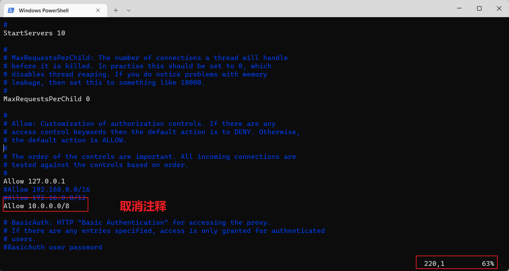
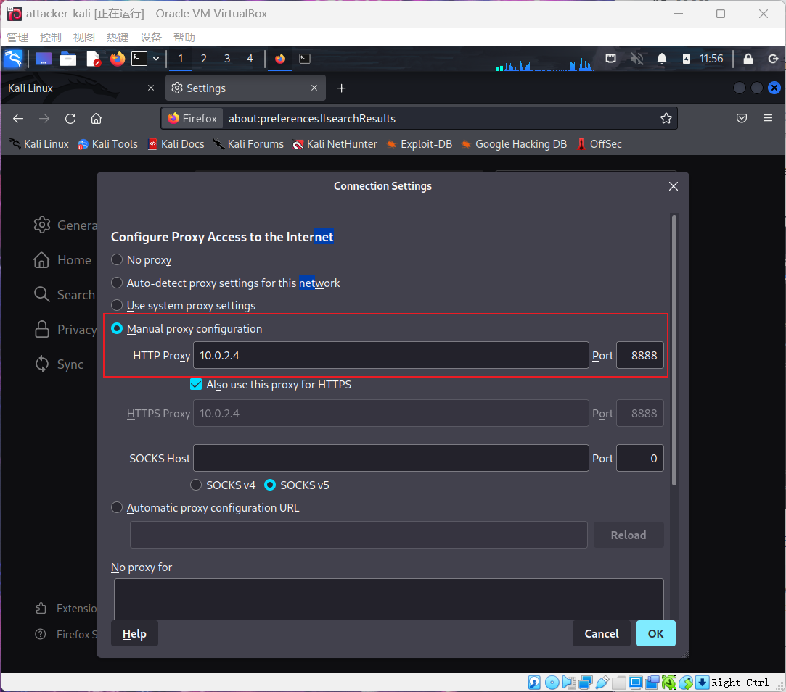
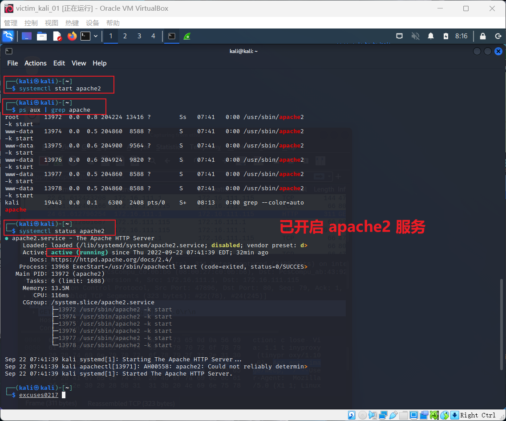
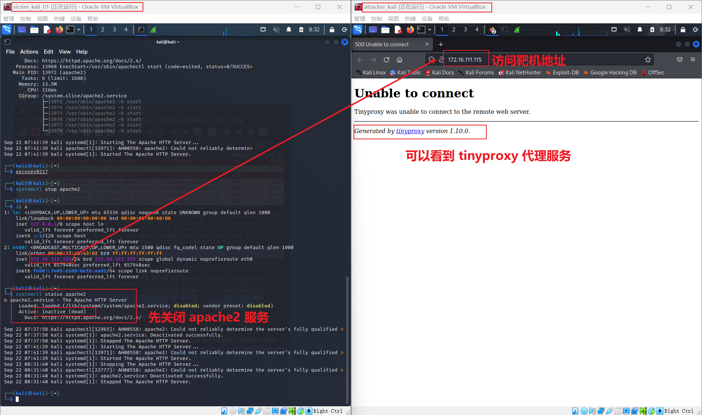
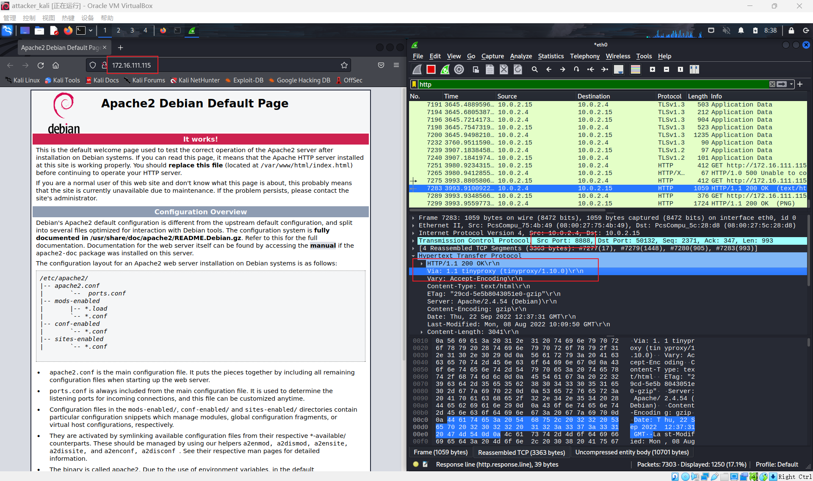
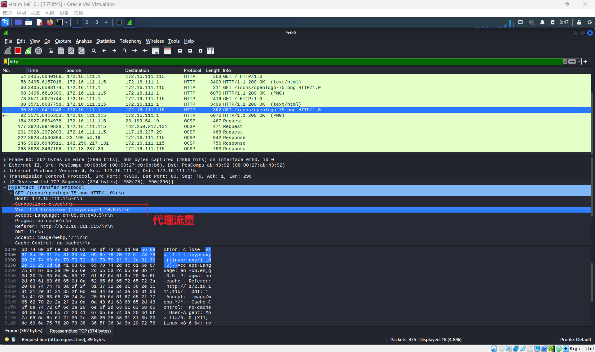

# 第三章 网络安全应用基础（实验）

## 实验目的

- Kali Linux 中安装`tinyproxy`
- 用主机设置浏览器代理指向 tinyproxy 建立的HTTP正向代理
- 在 Kali 中用 wireshark 抓包
- 分析抓包过程，理解 HTTP 正向代理 HTTPS 流量的特点


## 实验环境

- Windows 11 宿主机
- VirtualBox 虚拟机
- 攻击者主机（Attacker）：Kali Rolling 2022
- 网关（Gateway, GW）：Debian Buster
- 靶机（Victim）：Kali


## HTTP代理服务器实验

### 配置并检查网络环境


### 网关（Gateway, GW）：Debian Buster 配置

#### 安装并配置 tinyproxy

```bash
# 安装（这里最好使用 apt）
apt-get update && apt-get install tinyproxy -y

# 编辑 tinyproxy 配置文件，取消 Allow 10.0.0.0/8 行首注释
sudo vim /etc/tinyproxy/tinyproxy.conf
# 这样就允许来自 10.0.0.0/8 网段的主机使用此代理服务器

# 配置完成后保存并重启服务使配置加载
# 启动/停止/查看状态/重启服务命令
systemctl start tinyproxy
systemctl stop tinyproxy
systemctl status tinyproxy
systemctl restart tinyproxy
```




### 攻击者主机（Attacker）：Kali Rolling 2022 配置

#### 在浏览器中配置代理转发服务

在攻击者主机（Attacker）中：

`打开浏览器`->`Open Application Menu`->`settings`->`General`->`Network Settings`->`Manual proxy configuration`

填写代理服务器地址（10.0.2.4）和端口（8888）




### 靶机（Victim）：Kali 配置

#### 开启靶机 Apache2 服务

为了使代理服务器的作用更加直观，这里我选择开启靶机的 Apache2 网络服务，通过代理服务器（Debian），攻击者主机（Attacker）可以访问靶机（Victim）上的 Apache2 网络服务，并产生流量以供分析。

```bash
# 开启服务
systemctl start apache2

# 查看 Apache2 进程
ps aux | grep apache

#查看 Apache2 状态
systemctl status apache2
```




### 抓包并分析代理流量

- 在攻击者主机（Attacker）和靶机（Victim）中同时开启 wireshark，并监听相应网卡流量（我这里都是 eth0）

- 先关闭靶机（Victim） Apache2 服务，并在攻击者主机（Attacker）中使用浏览器访问靶机（Victim）地址（172.16.111.115）

  ```bash
  # 关闭靶机（Victim） Apache2 服务
  systemctl stop apache2
  ```

  

- 开启靶机（Victim） Apache2 服务后，在攻击者主机（Attacker）中使用浏览器访问靶机（Victim）地址（172.16.111.115）

  

  可以看到攻击者主机（Attacker）成功通过代理服务器访问靶机（Victim），并对 wireshark 的流量进行分析可以发现 HTTP 响应头中有`Via: 1.1 tinyproxy (tinyproxy/1.10.0)`、`Srt Port：8888`字段，这说明了攻击者访问靶机需要通过代理服务器 tinyproxy 的 8888 端口实现访问。

- 同理，在靶机（Victim）中对 wireshark 抓包的流量分析

  

  同样可以发现来自代理服务器地址（172.16.111.1）的流量，并在 HTTP 头中发现了`Via: 1.1 tinyproxy (tinyproxy/1.10.0)`字段。攻击者主机（Attacker）访问本机的 IP 地址等信息被隐藏。

