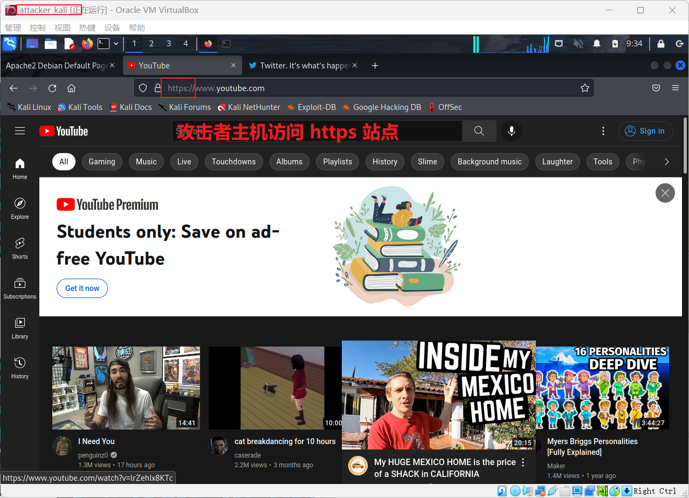
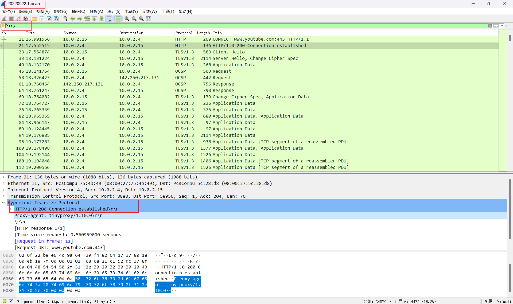

# 第三章 网络安全应用基础（实验）

## 实验目的

- Kali Linux 中安装`tinyproxy`
- 用主机设置浏览器代理指向 tinyproxy 建立的HTTP正向代理
- 在 Kali 中用 wireshark 抓包
- 分析抓包过程，理解 HTTP 正向代理 HTTPS 流量的特点


## 实验环境

- Windows 11 宿主机
- VirtualBox 虚拟机
- 攻击者主机（Attacker）：Kali Rolling 2022
- 网关（Gateway, GW）：Debian Buster
- 靶机（Victim）：Kali


## HTTP 代理服务器实验 步骤

### 一、配置并检查网络环境

本次实验网络环境请参考[第一章实验](https://github.com/CUCCS/2022-ns-public-excuses0217/blob/chap0x01/chap0x01/%E7%AC%AC%E4%B8%80%E7%AB%A0%20%E5%9F%BA%E4%BA%8E%20VirtualBox%20%E7%9A%84%E7%BD%91%E7%BB%9C%E6%94%BB%E9%98%B2%E5%9F%BA%E7%A1%80%E7%8E%AF%E5%A2%83%E6%90%AD%E5%BB%BA.md#%E5%AE%9E%E9%AA%8C%E8%A6%81%E6%B1%82)

各主机 IP 地址

| 虚拟机（攻击者/被攻击者-系统-内网） | 连接方式            | IP                       |
| ----------------------------------- | ------------------- | ------------------------ |
| attacker_kali                       | NAT 网络            | 10.0.2.15                |
| gw_debian                           | NAT 网络、内部网络1 | 10.0.2.4 \| 172.16.111.1 |
| victim_kali_01                      | 内部网络1           | 172.16.111.115           |

网络拓扑图


### 二、网关（Gateway, GW）：Debian Buster 配置

##### 安装并配置 tinyproxy

```bash
# 安装（这里最好使用 apt 而不是 apt-get）
apt-get update && apt-get install tinyproxy -y

# 编辑 tinyproxy 配置文件，取消 Allow 10.0.0.0/8 行首注释
sudo vim /etc/tinyproxy/tinyproxy.conf
# 这样就允许来自 10.0.0.0/8 网段的主机使用此代理服务器

# 配置完成后保存并重启服务使配置加载
# 启动/停止/查看状态/重启服务命令
systemctl start tinyproxy
systemctl stop tinyproxy
systemctl status tinyproxy
systemctl restart tinyproxy
```


### 三、攻击者主机（Attacker）：Kali Rolling 2022 配置

##### 在浏览器中配置代理转发服务

在攻击者主机（Attacker）中：

`打开浏览器`->`Open Application Menu`->`settings`->`General`->`Network Settings`->`Manual proxy configuration`

填写代理服务器地址（10.0.2.4）和端口（8888）


### 四、靶机（Victim）：Kali 配置

##### 开启靶机 Apache2 服务

为了使代理服务器的作用更加直观，这里我选择开启靶机的 Apache2 网络服务，通过代理服务器（Debian），攻击者主机（Attacker）可以访问靶机（Victim）上的 Apache2 网络服务，并产生流量以供分析。

```bash
# 开启服务
systemctl start apache2

# 查看 Apache2 进程
ps aux | grep apache

#查看 Apache2 状态
systemctl status apache2
```


### 五、抓包并分析代理流量

- 在攻击者主机（Attacker）和靶机（Victim）中同时开启 wireshark，并监听相应网卡流量（我这里都是 eth0）

- 先关闭靶机（Victim） Apache2 服务，并在攻击者主机（Attacker）中使用浏览器访问靶机（Victim）地址（172.16.111.115）

  ```bash
  # 关闭靶机（Victim） Apache2 服务
  systemctl stop apache2
  ```

  

- 开启靶机（Victim） Apache2 服务后，在攻击者主机（Attacker）中使用浏览器访问靶机（Victim）地址（172.16.111.115）

  

  可以看到攻击者主机（Attacker）成功通过代理服务器访问靶机（Victim），并对 wireshark 的流量进行分析可以发现 HTTP 响应头中有`Via: 1.1 tinyproxy (tinyproxy/1.10.0)`、`Srt Port：8888`字段，这说明了攻击者访问靶机需要通过代理服务器 tinyproxy 的 8888 端口实现访问。

- 同理，在靶机（Victim）中对 wireshark 抓包的流量分析

  

  同样可以发现来自代理服务器地址（172.16.111.1）的流量，并在 HTTP 头中发现了`Via: 1.1 tinyproxy (tinyproxy/1.10.0)`字段。攻击者主机（Attacker）访问本机的 IP 地址等信息被隐藏。

### 六、使用 HTTP 代理服务器访问 HTTPS 站点

Q：使用http代理服务器访问HTTPS站点时，通信传输内容是否会被代理服务器“看到”？

A：结论是代理服务器不知道客户端和服务器的HTTPS通信内容，但代理服务器知道客户端访问了哪个HTTPS站点，这是由http代理的协议机制决定的：代理客户端会发送Connect请求到http代理服务器。

实验验证：在Kali Linux中安装tinyproxy，然后用主机设置浏览器代理指向tinyproxy建立的HTTP正向代理，在Kali中用wireshark抓包，分析抓包过程，理解HTTP正向代理HTTPS流量的特点。

提醒注意：

> HTTP代理服务器在转发客户端请求时，可能会添加Via字段，从而向目标站点暴露客户端正在使用代理访问。类似的，匿名通信应用tor的部分出口节点也会在http请求中自动加入via字段，向被访问站点宣告：当前请求正在使用匿名通信网络tor提供的匿名通信服务。

##### 获取样本流量

在网关（Gateway, GW）中监听网卡 enp0s3，即攻击者主机（Attacker）的网段

```bash
# 利用工具 tcpdump 抓包
tcpdump -i enp0s3 -n -w 20220922.1.pcap
```

在攻击者主机（Attacker）用浏览器随意访问几个 HTTPS 站点，产生网络流量后退出在网关（Gateway, GW）的抓包




##### 用 Wireshark 分析流量

```bash
# 将抓到的包复制在宿主机中方便分析

# 在 Windows Terminal 中打开
scp root@192.168.56.113:/root/workspace20220912.1.pcap ./
```

流量抓包如下



同样可以看到，在 HTTP 头中发现了`Via: 1.1 tinyproxy (tinyproxy/1.10.0)`字段。分析可知，HTTP 代理服务器在转发客户端请求时，可能会添加 Via 字段，从而向目标站点暴露客户端正在使用代理访问。

同时，代理服务器可以看到用户访问的目标网址和用户网址


可以看到，目标网址传输的数据会通过 https 协议加密，代理服务器无法获取其中的内容。

所以代理服务器不知道客户端和服务器的HTTPS通信内容，但代理服务器知道客户端访问了哪个 HTTPS 站点


## 遇到的问题及解决方法

- 用 wireshark 在攻击者主机（Attacker）中使用浏览器访问靶机（Victim）地址（172.16.111.115）抓包时无法产生流量

  火狐浏览器缓存导致。由于我之前访问过此网站，浏览器将其静态网页缓存到了本地，导致我第二次访问并抓包时没有产生流量。在`Open Application Menu`->`History`->`Clear Recent History`清理一下缓存就可以正常抓包了。


## 参考链接

- [网络安全 gitbook 黄玮](https://c4pr1c3.github.io/cuc-ns/)


## 课后思考题

1. 代理技术在网络攻防中的意义？

   (1) 对攻方的意义？ 

   - 能访问本无法访问的机器（如本实验中攻击者访问靶机）。
   - 被攻击者无法判断攻方身份（如本实验中靶机无法确定攻击者的身份），攻击无法溯源。

   (2) 对守方的意义？

   - 被攻击者无法判断攻方身份（如本实验中靶机无法确定攻击者的身份），攻击无法溯源。

2. 常规代理技术和高级代理技术的设计思想区别与联系？

   - 区别：高级代理技术的匿名通信技术放大了网络安全对抗的复杂性。
   - 联系：可以通过常用代理技术实现高级代理。