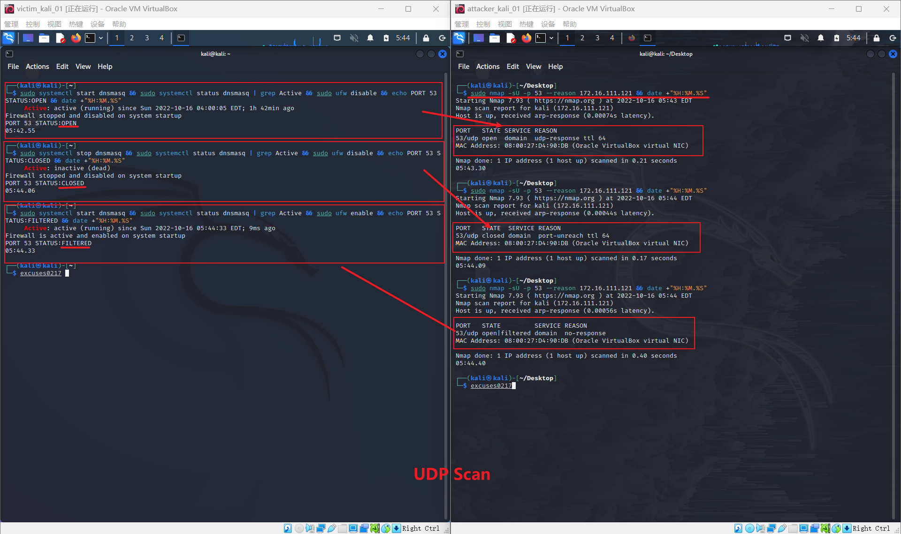

# 第五章 网络与系统渗透（实验）

——基于 Scapy 编写端口扫描器


## 实验目的

- 掌握网络扫描之端口状态探测的基本原理


## 实验环境

- Windows 11 宿主机
- VirtualBox 虚拟机
- 攻击者主机（Attacker）：Kali-rolling 2022.3
- 网关（Gateway, GW）：Debian Buster
- 靶机（Victim）：Kali-rolling 2022.3
- python3 + [scapy](https://scapy.net/)


## 实验要求

- [x] 禁止探测互联网上的 IP ，严格遵守网络安全相关法律法规
- [x] 完成以下扫描技术的编程实现
  - [x] TCP connect scan / TCP stealth scan
  - [x] TCP Xmas scan / TCP fin scan / TCP null scan
  - [x] UDP scan
- [x] 上述每种扫描技术的实现测试均需要测试端口状态为：`开放`、`关闭` 和 `过滤` 状态时的程序执行结果
- [x] 提供每一次扫描测试的抓包结果并分析与课本中的扫描方法原理是否相符？如果不同，试分析原因；
- [x] 在实验报告中详细说明实验网络环境拓扑、被测试 IP 的端口状态是如何模拟的
- [x] （可选）复刻 `nmap` 的上述扫描技术实现的命令行参数开关


## 实验准备

### 网络拓扑图


### 模拟端口状态设置

#### 端口状态对应模拟效果

| Port Status | Service Listening Status | ufw Status                 |
| ----------- | ------------------------ | -------------------------- |
| Closed      | inactive                 | disable                    |
| Open        | active                   | deny [Port(n)]/[tcp/udp]   |
| Filter      | active                   | enable [Port(n)]/[tcp/udp] |

##### 选取监听服务

- apache2 服务：80/TCP
- DNS 服务：53/UDP
- [或使用 python 开启监听程序](https://docs.python.org/3/library/http.server.html)  `python -m http.server 80` 或 nc 监听

```bash
# 安装相应服务程序
sudo apt install dnsmasq

# 开启/关闭端口监听服务
sudo systemctl start [service]
sudo systemctl stop [service]

# 查看服务状态
sudo systemctl status [service]

# 使用 nc 监听
# 指定端口监听
nc -l -p [Port(n)]

# 查看处于监听状态的端口
lsof -i 4 -L -P -n
```

##### 使用 ufw

```bash
# 安装 ufw
sudo apt install ufw

# 开启/关闭防火墙
sudo ufw enable
sudo ufw disable

# 开启/关闭端口防火墙过滤状态
sudo ufw deny [Port(n)]/[tcp/udp]
sudo ufw allow [Port(n)]/[tcp/udp]
```

##### 可使用 iptables

```bash
# 允许端口访问
sudo iptables -A INPUT -p tcp --dport [Port(n)] -j ACCEPT

# 端口过滤
sudo iptables -A INPUT -p tcp --dport [Port(n)] -j DROP
```

##### 使用 Nmap

```bash
# kali 内已经预安装

# 查看使用方法
nmap -h

# Nmap 7.92 ( https://nmap.org )
# Usage: nmap [Scan Type(s)] [Options] {target specification}
# ...
# SCAN TECHNIQUES:
#   -sS/sT/sA/sW/sM: TCP SYN/Connect()/ACK/Window/Maimon scans
#   -sU: UDP Scan
#   -sN/sF/sX: TCP Null, FIN, and Xmas scans
#   --scanflags <flags>: Customize TCP scan flags
#   -sI <zombie host[:probeport]>: Idle scan
#   -sY/sZ: SCTP INIT/COOKIE-ECHO scans
#   -sO: IP protocol scan
#   -b <FTP relay host>: FTP bounce scan
# ...
```


#### 实验脚本代码

[查看源代码文件 scan.py](scan.py)

```bash
# 查看使用帮助
sudo python scan.py -h
```


## 实验过程

### TCP Connect Scan

#### 实现原理

- connect( )
- 完成TCP三次握手

| 序号 | 通信方向 | 流程 1      | 流程 2      | 流程 3                  |
| :--- | :------- | :---------- | :---------- | :---------------------- |
| 1    | C -> S   | SYN+Port(n) | SYN+Port(n) | SYN+Port(n)             |
| 2    | S -> C   | SYN/ACK     | RST         | 无响应/其他拒绝反馈报文 |
| 3    | C -> S   | ACK         |             |                         |
| 4    | C -> S   | RST         |             |                         |
|      | 状态推断 | 开放 ✅      | 关闭 ⛔      | 被过滤 ⚠️                |

#### 实验结果

##### 端口状态：开放


##### 端口状态：关闭


##### 端口状态：过滤


#### Nmap 复刻

```bash
sudo nmap -sT -p 80 --reason 172.16.111.121
```


### TCP Stealth Scan（TCP SYN scan）

#### 实现原理

- 仅发送 SYN 包
- 不建立完整TCP连接

| 序号 | 通信方向 | 流程 1      | 流程 2      | 流程 3                  |
| :--- | :------- | :---------- | :---------- | :---------------------- |
| 1    | C -> S   | SYN+Port(n) | SYN+Port(n) | SYN+Port(n)             |
| 2    | S -> C   | SYN/ACK     | RST         | 无响应/其他拒绝反馈报文 |
| 3    | C -> S   | RST         |             |                         |
|      | 状态推断 | 开放 ✅      | 关闭 ⛔      | 被过滤 ⚠️                |

#### 实验结果

##### 端口状态：开放


##### 端口状态：关闭


##### 端口状态：被过滤


#### Nmap 复刻

```bash
sudo nmap -sS -p 80 --reason 172.16.111.121
```


### TCP Xmas Scan

#### 实现原理

- 设置 TCP 报文头 FIN、URG 和 PUSH 标记

| 序号 | 通信方向 | 流程 1                            | 流程 2                            |
| :--- | :------- | :-------------------------------- | :-------------------------------- |
| 1    | C -> S   | TCP FIN(1),PUSH(1),URG(1)+Port(n) | TCP FIN(1),PUSH(1),URG(1)+Port(n) |
| 2    | S -> C   | RST                               | 无响应/其他拒绝反馈报文           |
|      | 状态推断 | 关闭 ⛔                            | 开放 ✅ / 关闭 ⛔ / 被过滤 ⚠️        |

#### 实验结果

##### 端口状态：开放、关闭、被过滤


#### Nmap 复刻

```bash
sudo nmap -sX -p 80 --reason 172.16.111.121
```


### TCP FIN Scan

#### 实现原理

- 仅发送 FIN 包

| 序号 | 通信方向 | 流程 1          | 流程 2                     |
| :--- | :------- | :-------------- | :------------------------- |
| 1    | C -> S   | TCP FIN+Port(n) | TCP FIN+Port(n)            |
| 2    | S -> C   | RST             | 无响应/其他拒绝反馈报文    |
|      | 状态推断 | 关闭 ⛔          | 开放 ✅ / 关闭 ⛔ / 被过滤 ⚠️ |

#### 实验结果

##### 端口状态：开放、关闭、被过滤


#### Nmap 复刻

```bash
sudo nmap -sF -p 80 --reason 172.16.111.121
```


### TCP Null Scan

#### 实现原理

- Null：关闭所有 TCP 报文头标记

| 序号 | 通信方向 | 流程 1                            | 流程 2                            |
| :--- | :------- | :-------------------------------- | :-------------------------------- |
| 1    | C -> S   | TCP FIN(0),PUSH(0),URG(0)+Port(n) | TCP FIN(0),PUSH(0),URG(0)+Port(n) |
| 2    | S -> C   | RST                               | 无响应/其他拒绝反馈报文           |
|      | 状态推断 | 关闭 ⛔                            | 开放 ✅ / 关闭 ⛔ / 被过滤 ⚠️        |

#### 实验结果

##### 端口状态：开放、关闭、被过滤


#### Nmap 复刻

```bash
sudo nmap -sT -p 80 --reason 172.16.111.121
```


### UDP Scan

#### 实现原理

- 向指定 UDP 端口发送数据
- 如果「语言相通」，则服务端会根据“语言内容”（UDP 上层应用协议约定）「响应数据」
- 如果「鸡同鸭讲」，则目标端口即使处于开放状态也可能会表现出「静默无响应」行为

| 序号 | 通信方向 | 流程 1               | 流程 2                     |
| :--- | :------- | :------------------- | :------------------------- |
| 1    | C -> S   | UDP+Port(n)          | UDP+Port(n)                |
| 2    | S -> C   | UDP+port(n) 响应数据 | 无响应/其他拒绝反馈报文    |
|      | 状态推断 | 开放 ✅               | 开放 ✅ / 关闭 ⛔ / 被过滤 ⚠️ |

#### 实验结果

##### 端口状态：开放、关闭、被过滤


#### Nmap 复刻

```bash
sudo nmap -sU -p 53 --reason 172.16.111.121
```




## 问题与反思

1. 当我在 Windows 环境下用 127.0.0.1 回环地址测试脚本时出现了报错

   > [winerror 10013] 以一种访问权限不允许的方式做了一个访问套接字的尝试。

   猜想应该是需要 **操作系统管理员权限** 构造 SYN 等报文，于是用管理员权限启动 VScode 后能够顺利运行。但是当我换一台 Windows 主机再次运行相同脚本时可以不用管理员权限也能正常运行。

   后来排查到应该是 Wireshark 包含的 Npcap 的问题，安装此工具并给予所有用户最高权限后就可正常运行。

2. 提供每一次扫描测试的抓包结果并分析与课本中的扫描方法原理是否相符？如果不同，试分析原因

   相符。


## 参考链接

- [网络安全电子书 黄玮](https://c4pr1c3.github.io/cuc-ns/)
- [第五章 网络扫描](https://c4pr1c3.github.io/cuc-ns-ppt/chap0x05.md.v4.html) | [PDF 打印版](https://c4pr1c3.github.io/cuc-ns-ppt/chap0x05.md.v4.html?print-pdf)
- [Nmap](https://nmap.org/)
- [argparse --- 命令行选项、参数和子命令解析器](https://docs.python.org/zh-cn/3/library/argparse.html)
- [Python-Penetration-Testing-Cookbook](https://github.com/PacktPublishing/Python-Penetration-Testing-Cookbook)
- [How to write a port scanner with Scapy?](https://karatos.com/art?id=df758f59-6be5-41d9-9e39-5d2aa6d3947e)
- [2022-ns-public-zhouyuting-mafumafu](https://github.com/CUCCS/2022-ns-public-zhouyuting-mafumafu/blob/chap0x05/chap0x05/%E5%AE%9E%E9%AA%8C5.md)
- [2022-ns-public-MengQiurong](https://github.com/CUCCS/2022-ns-public-MengQiurong/blob/chap0x05/READEME.md)
- [tshark](https://www.wireshark.org/docs/man-pages/tshark.html)


## 课后思考题

- 通过本章网络扫描基本原理的学习，试推测应用程序版本信息的扫描原理，和网络漏洞的扫描原理。

  - 应用程序版本信息的扫描原理：大部分的信息在互联网上是可以自由访问的。这种对于目标主机、目标网络和目标应用/服务的信息采集的方式便是直接访问。而另外一种踩点便是黑盒测试，可使用特定的客户端连接指定端口/应用/服务，例如使用浏览器 /FTP/telnet 远程连接等；也可使用特定账号和口令尝试登录；或者进行交互模仿的方式进行信息采集。

  - 漏洞扫描系统的工作原理：是当用户通过控制平台发出了扫描命令之后，控制平台即向扫描模块发出相应的扫描请求，扫描模块在接到请求之后立即启动相应的子功能椟，对被扫描主机进行扫描，通过对从被扫描主机返回的信息进行分析判断，扫描模块将扫描结果返回给控制平台，再由控制平台最终呈现给用户。

    系统管理员能够发现所维护的Web服务器的各种TCP/IP端口的分配、开放的服务、Web服务软件版本和这些服务及软件呈现在Internet上的安全漏洞。网络安全漏洞扫描技术也是采用积极的、非破坏性的办法来检验系统是否有可能被攻击崩溃。其利用了一系列的脚本模拟对系统进行攻击的行为，并对结果进行分析。这种技术通常被用来进行模拟攻击实验和安全审计。

- 网络扫描知识库的构建方法有哪些？

  - 互联网地址指派机构（Internet Assigned Numbers Authority, IANA）注册端口号
  
    根据传输层报文头部字段的特征进行构建。公用端口为：0~1023；注册端口为：1024~49151；动态的或私有端口为：49152~65535。
  
  - /etc/services 文件
  
    /etc/services 文件是记录网络服务名和它们对应使用的端口号及协议。文件中的每一行对应一种服务，它由 4 个字段组成，中间用 TAB 或空格分隔，分别表示“服务名称”、“使用端口”、“协议名称”以及“别名”。
  
  - 关于主机状态详细信息
  
  - 网络扫描：主机扫描和端口扫描
  
  
